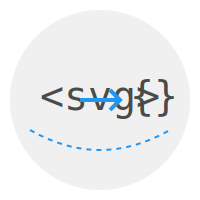

<p align="center">    </p>

# next-svg-parser

[](https://badge.fury.io/js/next-svg-parser)
[](https://github.com/yourusername/next-svg-parser/actions)

A robust and efficient SVG to JSON parser built with TypeScript, leveraging the power of DOMParser for accurate SVG parsing.

## Features

- Parses SVG strings into a structured JSON format
- Handles complex, nested SVG structures
- Supports all SVG elements and attributes
- Processes SVG with comments, CDATA sections, and namespaces
- High test coverage (90%+) ensuring reliability
- Lightweight and easy to integrate

## Installation

```bash
npm install next-svg-parser
```

or

```bash
pnpm install next-svg-parser
```

or

```bash
yarn add next-svg-parser
```

## address

For more information, see the [npm package page](https://www.npmjs.com/package/next-svg-parser).

## Usage

1. When building single page applications **(SPA)** using **Vite**, you should:

   ```html
   // react.svg
   <svg xmlns="http://www.w3.org/2000/svg" width="200" height="200" viewBox="0 0 200 200">
     <circle cx="100" cy="100" r="90" fill="#f0f0f0"/>
     <text x="40" y="110" font-family="monospace" font-size="40" fill="#4a4a4a">&lt;svg&gt;</text>
     <path d="M80 100 L120 100 M110 90 L120 100 L110 110" stroke="#2196f3" stroke-width="4" fill="none"/>
     <text x="130" y="110" font-family="monospace" font-size="40" fill="#4a4a4a">{}</text>
     <path d="M30 130 Q100 170 170 130" stroke="#2196f3" stroke-width="2" fill="none" stroke-dasharray="5,5">
       <animate attributeName="stroke-dashoffset" from="10" to="0" dur="2s" repeatCount="indefinite"/>
     </path>
   </svg>
   ```

   ```tsx
   // App.tsx
   import reactSVG from "./assets/react.svg?raw"
   import {parserSVG} from "next-svg-parser"
   
   function App() {
   	const svgJosn = parserSVG(reactSVG)
   }
   
   ```

   result:

   ```json
   {
       "tagName": "svg",
       "type": "element",
       "attributes": {
           "xmlns": "http://www.w3.org/2000/svg",
           "width": "200",
           "height": "200",
           "viewBox": "0 0 200 200"
       },
       "children": [
           {
               "tagName": "circle",
               "type": "element",
               "attributes": {
                   "cx": "100",
                   "cy": "100",
                   "r": "90",
                   "fill": "#f0f0f0"
               },
               "children": []
           },
           {
               "tagName": "text",
               "type": "element",
               "attributes": {
                   "x": "40",
                   "y": "110",
                   "font-family": "monospace",
                   "font-size": "40",
                   "fill": "#4a4a4a"
               },
               "children": [
                   {
                       "tagName": "text",
                       "type": "text",
                       "attributes": {},
                       "children": [],
                       "content": "<svg>"
                   }
               ]
           },
           {
               "tagName": "path",
               "type": "element",
               "attributes": {
                   "d": "M80 100 L120 100 M110 90 L120 100 L110 110",
                   "stroke": "#2196f3",
                   "stroke-width": "4",
                   "fill": "none"
               },
               "children": []
           },
           {
               "tagName": "text",
               "type": "element",
               "attributes": {
                   "x": "130",
                   "y": "110",
                   "font-family": "monospace",
                   "font-size": "40",
                   "fill": "#4a4a4a"
               },
               "children": [
                   {
                       "tagName": "text",
                       "type": "text",
                       "attributes": {},
                       "children": [],
                       "content": "{}"
                   }
               ]
           },
           {
               "tagName": "path",
               "type": "element",
               "attributes": {
                   "d": "M30 130 Q100 170 170 130",
                   "stroke": "#2196f3",
                   "stroke-width": "2",
                   "fill": "none",
                   "stroke-dasharray": "5,5"
               },
               "children": [
                   {
                       "tagName": "animate",
                       "type": "element",
                       "attributes": {
                           "attributeName": "stroke-dashoffset",
                           "from": "10",
                           "to": "0",
                           "dur": "2s",
                           "repeatCount": "indefinite"
                       },
                       "children": []
                   }
               ]
           }
       ]
   }
   ```

2. Use the cli command line via node：

   - Add script directives to the scripts option of your `package.json` file

     ```json
     "scripts": {
         "generate-svg-json": "next-svg-parser input output"
       }
     ```

   - Some application scenarios

     - ```json
       Processing a single file, specifying the output directory
       
       "generate-svg-json": "next-svg-parser src/assets/react.svg src/json/react.json"
       or
       "generate-svg-json": "next-svg-parser src/assets/react.svg src/json"
       ```

     - ```json
       Processing the entire catalogue
       "generate-svg-json": "next-svg-parser src/assets src/json"
       ```

     - ```json
       Process a single file, specify a specific output file.
       "generate-svg-json": "next-svg-parser src/assets/test.svg src/json/test.json"
       ```

     - ```json
       Process individual files to a specified non-existent directory (automatically creates the directory and writes to the file)
       
       "generate-svg-json": "next-svg-parser src/assets/test.svg src/json1/test.svg"
       
       reslut: src/json1/test.svg
       ```

     - ```json
       Dispose of the whole directory, to a non-existent directory (create this directory and write to it)
       "generate-svg-json": "next-svg-parser src/assets src/json3/"
       
       result: src/json3/**.json
       ```

## API

### `parseSVG(svgString: string): SVGNode`

Parses an SVG string and returns a JSON representation of the SVG structure.

- `svgString`: A string containing valid SVG markup.
- Returns: An `SVGNode` object representing the parsed SVG structure.

## Types

```ts
export interface SVGNode {
    type: 'element' | 'text' | 'cdata';
    tagName?: string;
    attributes?: { [key: string]: string };
    children?: SVGNode[];
    content?: string;
    cdataContent?: string;
}
```

## Testing

This library has a test coverage of over 90%. We use Vitest for running tests and generating coverage reports.

To run the tests:

```
bash

Copy

npm test
```

To view the test coverage report:

```
bash

Copy

npm run coverage
```

Our test suite covers various scenarios including:

- Simple and complex SVG structures
- Nested elements
- Text content
- Self-closing tags
- Multiple attributes
- Whitespace handling
- SVG with comments and CDATA sections
- Namespace handling
- Edge cases and error handling

## Contributing

We welcome contributions! If you'd like to contribute, please follow these steps:

1. Fork the repository
2. Create your feature branch (`git checkout -b feature/AmazingFeature`)
3. Commit your changes (`git commit -m 'Add some AmazingFeature'`)
4. Push to the branch (`git push origin feature/AmazingFeature`)
5. Open a Pull Request

Please ensure that your code adheres to the existing style and that all tests pass. If you're adding new functionality, please include appropriate tests.

## Feedback and Issues

If you encounter any issues or have suggestions for improvements, please open an issue on our GitHub repository. We appreciate your feedback and contributions to making this library better.

## License

This project is licensed under the MIT License - see the [LICENSE](LICENSE) file for details.

------

Made with ❤️ by [Your Name/Organization]

We're constantly working to improve next-svg-parser. If you have any suggestions or find any bugs, please don't hesitate to contribute or reach out!